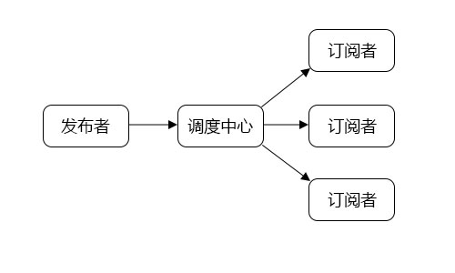

看过很多的Promise规范的实现，近来研究了一些设计模式在JavaScript中的应用和实践，其中在JS中应用的最多的就应属发布/订阅模式(Pub-Sub)了。

而Promise的很多实现原理又与发布/订阅模式有着千丝万缕的联系。我将尝试着从一个最简化的Promise实现中追寻发布/订阅模式的痕迹。

# 1 准备工作
## 1.1 发布/订阅模式

首先用一个最简单的例子来建立一个基本的概念。上学的时候我们都干过一件事：当你正准备在课上睡觉之前，你会跟你的同桌说一声“老师来了叫我”。这就是一个最基本的发布订阅模式了，你作为**订阅者**向你的同桌**发布者**订阅了**老师来了**这个事件。

这是一个最简单的一对一订阅模型，实际上事情可能还会变得更有趣一些。也许你前面的同学也向你的同桌订阅了老师来了这个事情，或者你只向同桌订阅了班主任来了和教导主任来了这两个事件，因为其他老师并不care你。最后，当你睡醒的时候，你便自动在同桌那取消了这个事件订阅。

一个正常的发布/订阅模型大概是这个样子的



(调度中心dispathcer，这个说法在我看到的各种设计模式书和文章里众说纷纭。但dispatcher这个概念是我目前在JS语言中最能接受的，所以先暂且先这么叫了。)

通常来说，发布/订阅模式具有两个非常实用的特点-异步和解耦
1. 异步:在我完成了订阅之后我就可以安心的睡觉了，不需要时刻盯着老师或者不停的问同桌老师来了没。
2. 解耦:实际上，当我睡觉的时候，我并不是监听的同桌的声音或者动作。我只需要监听‘老师来了’这句话。最终唤醒我的也是这句话而不是我的同桌。一句话可能有点抽象，那如果是老师来了的时候请扔个橡皮擦过来。这个时候橡皮差就替代了‘老师来了’这句话，我只需要盯着同桌的橡皮擦什么时候飞过来或，者说什么时候被橡皮擦砸到(但愿砸你的不是老师的黑板擦)，而不需要盯着同桌。所以我和我的同桌之间也就自然不存在耦合关系了。

## 1.2 Promise/A+规范核心

[Promise/A+](Promises/A+)([译文版](【翻译】Promises/A+规范-图灵社区))是一种异步模式编程规范。燃鹅,它只说了这东西应该是啥样的，有哪些行为，并没有给出一个标准实现。并且，规范中很多条目也都是在描述一些边界情况和行为细节。本文并不会去解读Promise/A+规范，也不会手把手来实现一遍这个规范。规范背后设计初衷和实现过程中采用的设计思维才是本文想去探讨的。其实，我理解的整个Promise的实现就是围绕着than函数而展开的。

## 1.3 Promise的最简化核心实现

那么现在，让我们先暂且放下种种边界情况，异常处理，假设只有resolve这一条路(pending -> fulfilled)，这个时候Promise还剩下什么。

```
function Promise(fn) {
    var state = 'pending',
        value = null,
        callbacks = [];
    this.then = function (onFulfilled) {
        return new Promise(function (resolve) {
            handle({
                onFulfilled: onFulfilled || null,
                resolve: resolve
            });
        });
    };
    function handle(callback) {
        if (state === 'pending') {
            callbacks.push(callback);
            return;
        }
        //如果then中没有传递任何东西
        if(!callback.onFulfilled) {
            callback.resolve(value);
            return;
        }
        var ret = callback.onFulfilled(value);
        callback.resolve(ret);
    }
    
    function resolve(newValue) {
        if (newValue && (typeof newValue === 'object' || typeof newValue === 'function')) {
            var then = newValue.then;
            if (typeof then === 'function') {
                then.call(newValue, resolve);
                return;
            }
        }
        state = 'fulfilled';
        value = newValue;
        setTimeout(function () {
            callbacks.forEach(function (callback) {
                handle(callback);
            });
        }, 0);
    }
    fn(resolve);
}
```

在这就不来一步一步的实现了，直接上代码。这段代码来自[Promise原理解析](https://github.com/mengera88)。这也是我目前看过的最精良的Promise核心实现了。

粗略的看一眼，一共50行代码，Promise内主要分成了三个函数 `than`, `handle` 和 `resolve`。不管你一眼看没看懂，反正我第一次看到这是花了2天时间去充分理解他们的细节，内部关系，还有意图。当然，这其中包含了远远不止三对的发布/订阅模式关系。接下来，我们以函数为单位逐个浅析一下他们各自的功能。

## 1.4 场景和术语定义
在正式进入剖析之前，让我们先来定义一个简单的使用场景，然后对部分场景中的对象进行一个抽象画的命名方便理解。
### 场景
依旧以老师来了为例，同桌`deskmate`对象上有一个函数`teacherWarning`，调用该函数会返回一个`Promise`对象，当老师来了的时候`Promise`对象的状态将变成`fulfilled`，并且调用注册在该`Promise`上的回调方法。
```
function Me() {
    this.name = 'Li Lei'
}

Me.prototype.wakeUp = function() {
 // 赶紧坐起来 翻开书 开启学霸模式
 ...
}

function Classmate() {
    this.name = 'Han Mei Mei'
}

Classmate.prototype.teacherWarning = function() {
    return new Promise((resolve) => {
        // 同桌会每秒钟观察一下老师的位置
        setInterval(() => {
            if(this.teach.position - this.position < 5)
                resolve()
        },1000)
    })
}

let me = new Me()
let deskmate = new Classmate()
let promise = deskmate.teacherWarning()
promise.then(me.wakeUp)
```
简单的定义了一下我和同桌两个对象，同桌的老师提醒函数会返回一个`Promise`对象

### 术语(自己编的)
- #### 发布者

    事件的发布者，在本场景中为同桌

- #### 订阅者

    事件的订阅者，在本场景中为我

- #### thenable对象

    JS鸭子类型特点，如果该对象有then函数(即thenable)，我们就将视它为Promise对象

- #### 内部回调函数

    `Promise`对象内部定义的回调函数，标准规范中对应的`resolve`和`reject`函数。本文简化后只保留`resolve`函数。`resolve`函数执行时有且只能带有一个参数。[发布函数](#发布函数)执行时将把[内部回调函数](#内部回调函数)作为参数传入发布函数。在1.3代码中为`Promise`内部的`resolve`函数。

- #### 发布函数

    在[发布者](#发布者)创建`Promise`对象的时候，传入构造函数的参数，该参数有且只有一个，并且该参数为一个函数，即[发布函数](#发布函数)。标准Promise规范中，[发布函数](#发布函数)应有两个参数，分别为发布函数内部执行成功(完成)时和执行失败(拒绝)时所需调用的对应回调函数。但在本文中简化为只有一个参数，即发布函数内部执行成功(完成)回调函数-[内部回调函数](#内部回调函数)。[发布函数](#发布函数)将在`Promise`对象初始化后立即执行并带上`Promise`对象的[内部回调函数](#内部回调函数)作为参数。在1.3代码中为`Promise`构造函数的`fn`。

- #### 订阅回调函数

    在[订阅者](#订阅者)通过`then`函数订阅该事件时传入的函数参数，标准Promise规范中为两个函数参数，第一个为事件完成时(fulfilled)执行的回调函数，第二个为事件拒绝时(rejected)执行的回调函数。本文简化后只保留`onFulfilled`函数。对应1.3中`than`函数的形参`onFulfilled`和1.4场景中的`me.wakeUp`作为实参。

有代码格式的单词`word`指代这个单词在代码中的本体位置，非代码格式的单词word指代这个单词所指的名词概念或和前后字符所组成的名词概念。

当我编完这些术语的时候真的感觉挺绕的，但是仔细想想，这里面有很多东西真的是跳不过去的。并且相比之后在文章中需要用大量文字去指代某一个概念或者变量，不如在这里先定义了，就像我们在写程序中定义常量那样。在这里先不用急着去理解或者记住每个术语，后文中出现这些术语的地方我将用链接的形式把这些术语标记出来并链接到对应的定义的位置。


啊，准备工作终于做完了，让我们开始剖析吧。


# 2 对比剖析
## 2.1 then-订阅事件

    作为Promise对象暴露出来的唯一函数，then函数的意义也就非常明确了-注册回调。让我们先把这段代码单独拎出来看看：
```
this.then = function (onFulfilled) {
    return new Promise(function (resolve) {
        handle({
            onFulfilled: onFulfilled || null,
            resolve: resolve
        });
    });
};
```
跟我们平时写的注册回调不一样，因为要支持链式调用，所以`then`函数必须返回一个`Promise`对象。此时，`then`函数返回的`Promise`的(内部回调函数)[#内部回调函数]`resolve`和调用`then`注册上来的`onFulfilled`函数都交由了`handle`函数处理。目前，我们仅需知道`handle`函数是属于调度中心的一部分，会根据本Promise的发布者发出的状态来处理相对应的回调函数(队列)。

这一段应该是最好理解的了。那么接下来，我们从发布/订阅模式来看看then函数所处的位置和作用。

## 2.2 resolve-发布事件
## 2.3 Promise本体-调度中心
## 2.4 链式Promise

# 3 感悟
## 3.1 Promise没有实现的发布/订阅模式部分
## 3.2 发布/订阅模式的特点
## 3.3 对于Promise中的映射
## 3.4 一些实践

# 4 总结

# 5 参考文献
